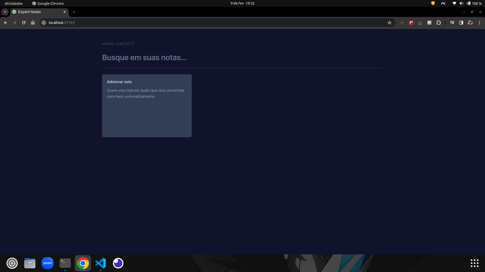
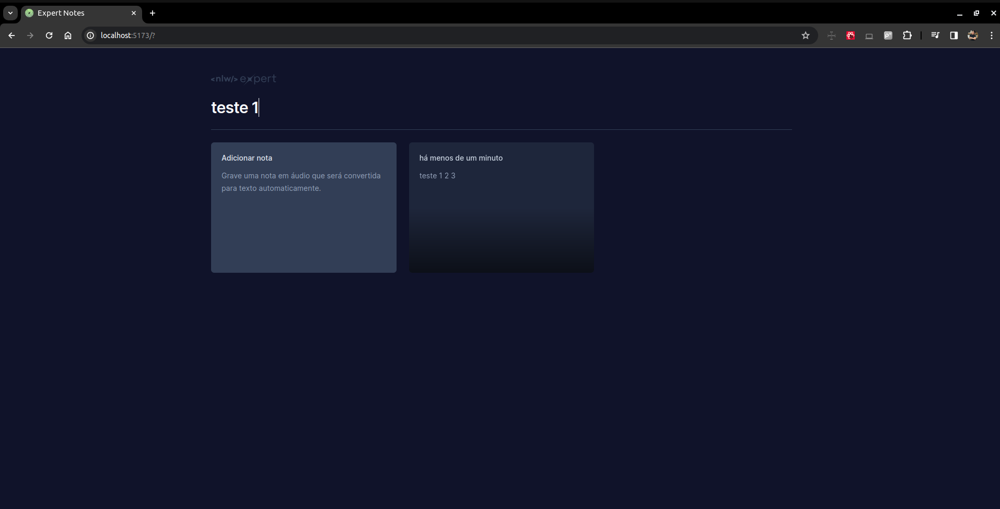
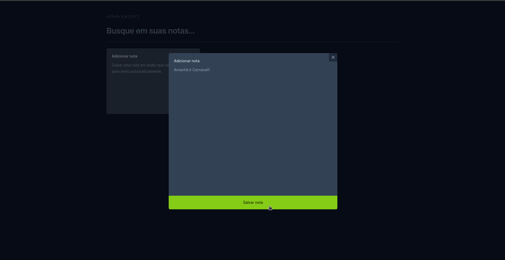
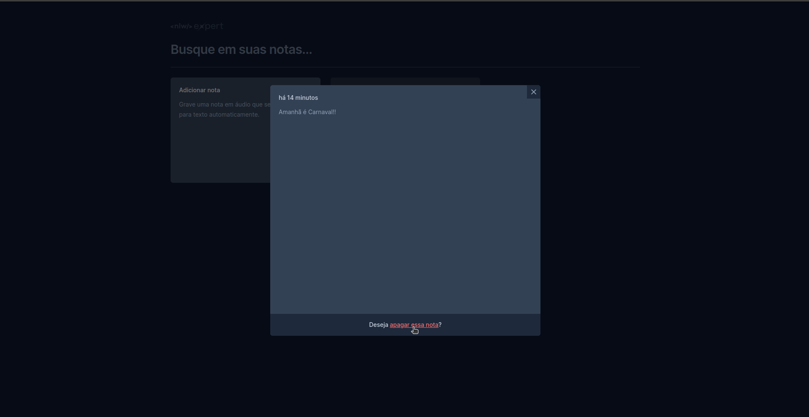
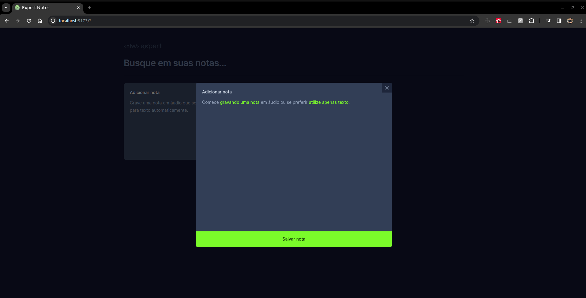
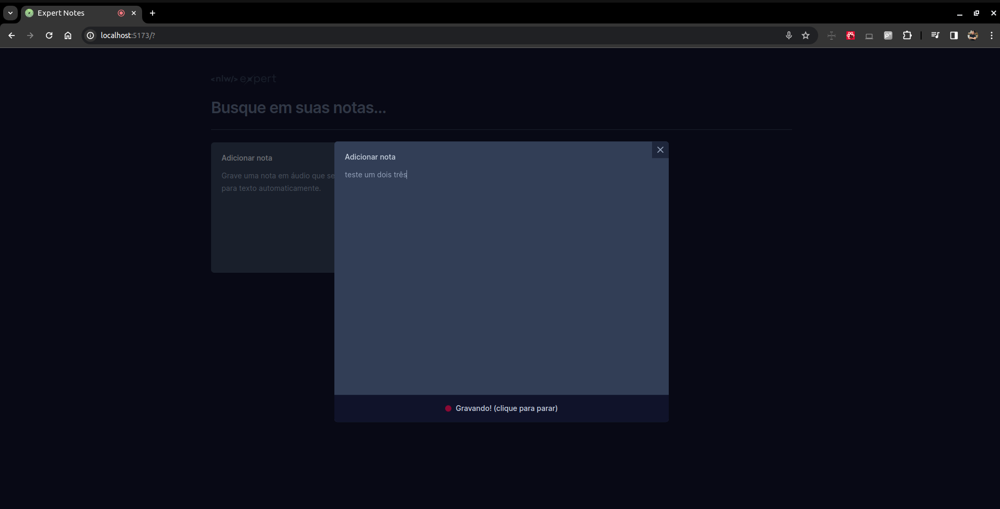

## Sobre ✔️

Lista de Anotações por mensagem de texto e voz, você fala por voz e ele reflete em texto e salva todas suas anotações em bloquinhos.

---

## Tecnologias Utilizadas 📎

Esse projeto foi desenvolvido com as seguintes tecnologias:

- [ReactJs](https://react.dev/learn/installation)
- [Vite](https://vitejs.dev/guide/)
- [TypeScript](https://www.typescriptlang.org/docs/)
- [Tailwind Css](https://tailwindcss.com/docs/installation)
- [Date-fns](https://date-fns.org/docs/Getting-Started)
- [Radix](https://www.radix-ui.com/themes/docs/overview/getting-started)
- [Lucide](https://lucide.dev/guide/installation)
- [Sonner](https://sonner.emilkowal.ski/getting-started)
- [SpeechRecognition](https://developer.mozilla.org/en-US/docs/Web/API/SpeechRecognition)

---

## Pré-requisitos 📝

Para rodar este projeto é necessário ter instalado na sua máquina as seguintes tecnologias:

- É necessário possuir o [Node.js](https://nodejs.org/en/) instalado na máquina.
- Também, é preciso ter um gerenciador de pacotes seja [Yarn](https://yarnpkg.com/) ou [Npm](https://www.npmjs.com/).

## Para rodar o projeto 📌

1. Escolher o emulador da sua preferência.
2. Instale as dependências: `npm install`
3. Startar a aplicação: `npm run dev`

## Resultado 📷

    
    
    
    
    
    

